# Flutter E-Commerce App 🛒

A modern **Flutter E-Commerce Mobile Application** that provides a complete shopping experience including authentication, product browsing, wishlist, cart management, checkout, secure payments, promo code discounts, and order tracking.

This project demonstrates building a **real-world Flutter application** using **GetX architecture, Firebase services, Stripe payments, and Cloudinary image hosting**.

---

# Features

## Authentication

* User Sign In
* User Registration
* Email Verification
* Password Reset
* Google Sign-In

## Product & Store

* Product Catalog
* Brand Filtering
* Product Categories
* Product Search
* Product Details
* Product Variations

## Shopping Experience

* Add to Cart
* Cart Management
* Checkout System
* Stripe Payment Integration
* Order Review Screen
* Order History Tracking

## Discounts

* Promo Code System
* Automatic Discount Calculation

## User Profile

* Profile Management
* Profile Editing
* Address Management
* Delete Address
* Multiple Saved Addresses

## UI / UX

* Light Mode & Dark Mode across the entire application
* Responsive Layout
* Smooth Animations
* Skeleton Loading Screens
* Clean Modern Design

---

# Tech Stack

* Flutter
* Dart
* GetX (State Management & Navigation)
* Firebase Authentication
* Cloud Firestore
* Stripe Payment Gateway
* Cloudinary Image Hosting

---

# App Screenshots

## Onboarding

| Screen 1                                | Screen 2                                | Screen 3                                |
| --------------------------------------- | --------------------------------------- | --------------------------------------- |
|  |  |  |

---

## Authentication

| Sign In                             | Sign Up                             |
| ----------------------------------- | ----------------------------------- |
| 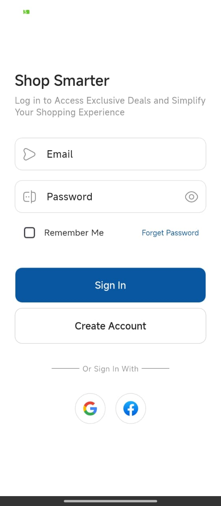 | 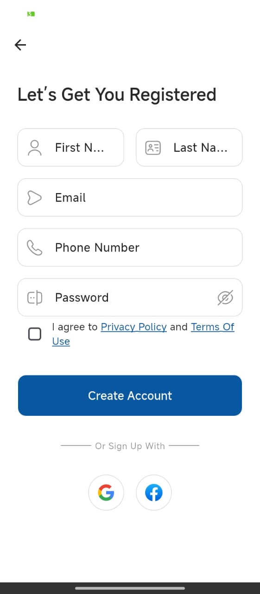 |

---

## Home (Light / Dark)

| Light Mode                        | Dark Mode                          |
| --------------------------------- | ---------------------------------- |
| 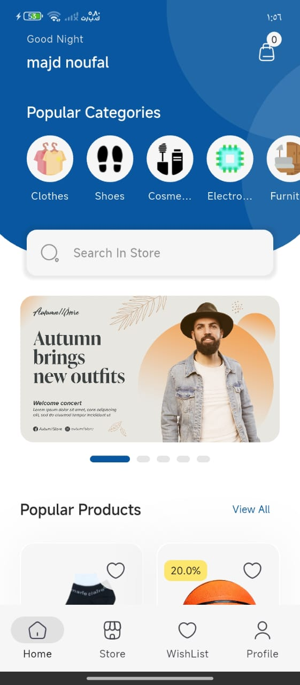 | 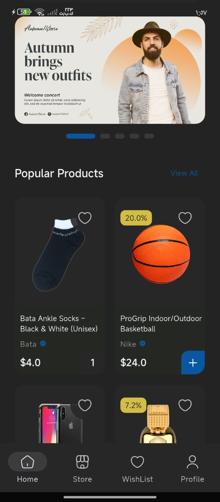 |

---

## Store

| Store View                         | All Brands                             |
| ---------------------------------- | -------------------------------------- |
|  | 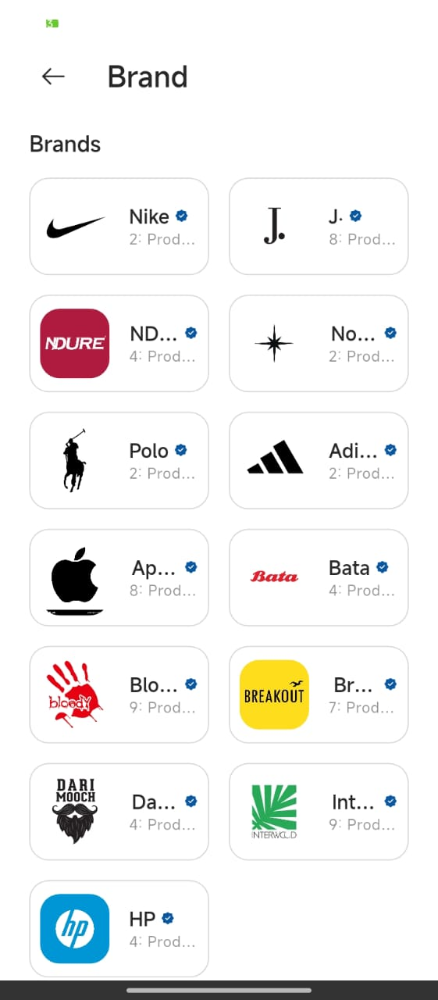 |

---

## Search

| Search Results                      | Search View                          |
| ----------------------------------- | ------------------------------------ |
| 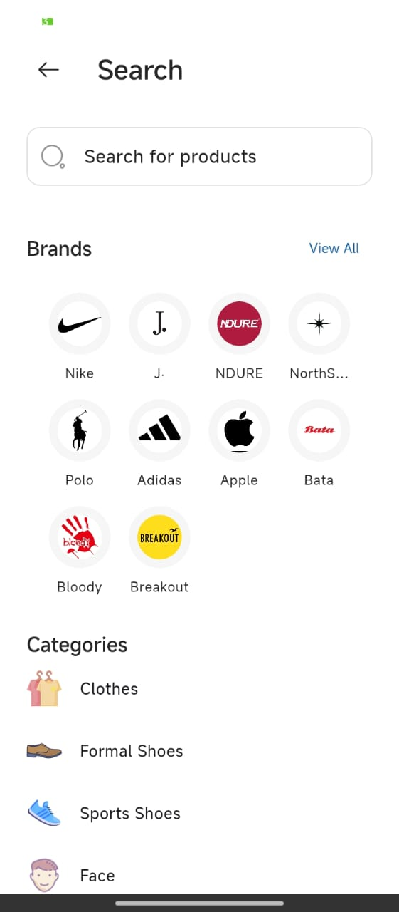 | 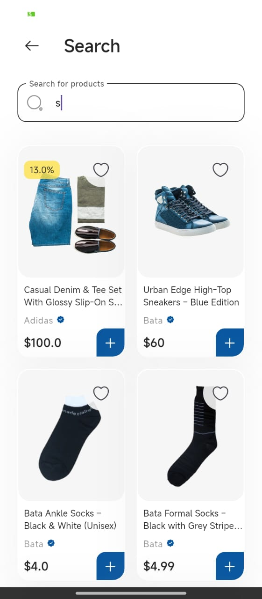 |

---

## Product Details

| Product Page                                | Product Variations                           |
| ------------------------------------------- | -------------------------------------------- |
|  |  |

---

## Wishlist

| Wishlist                              |
| ------------------------------------- |
|  |

---

## Cart & Checkout

| Cart                              | Order Review                             |
| --------------------------------- | ---------------------------------------- |
| 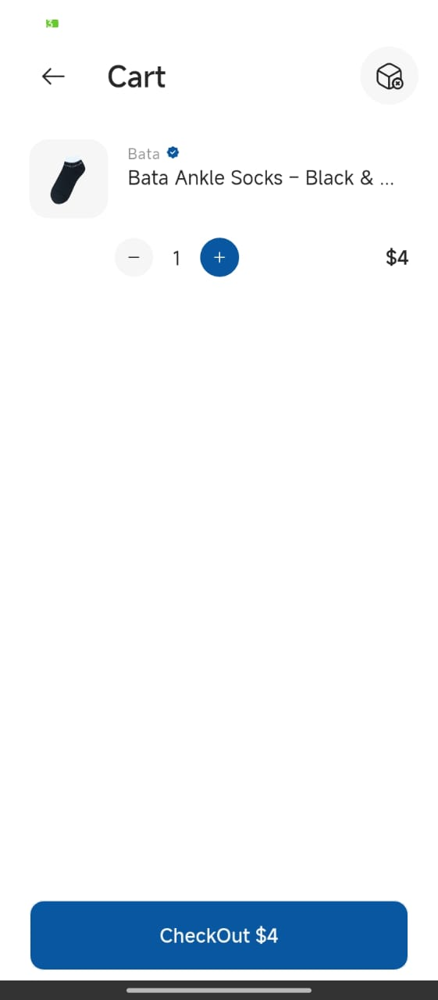 | 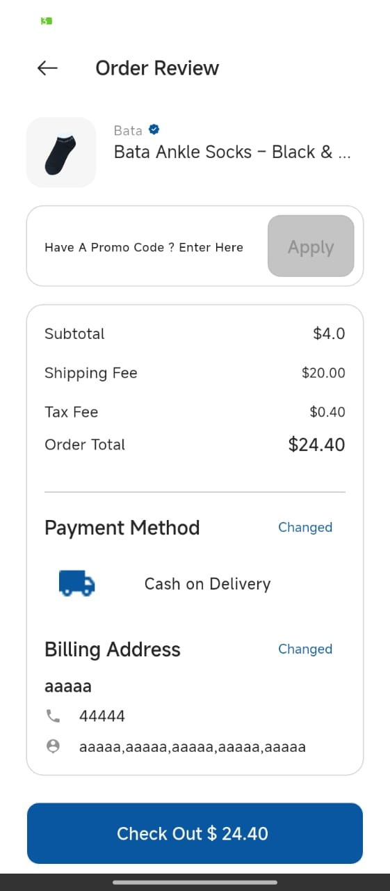 |

---

## Payments

| Stripe Payment                              |
| ------------------------------------------- |
|  |

---

## Orders

| Order History                         |
| ------------------------------------- |
| 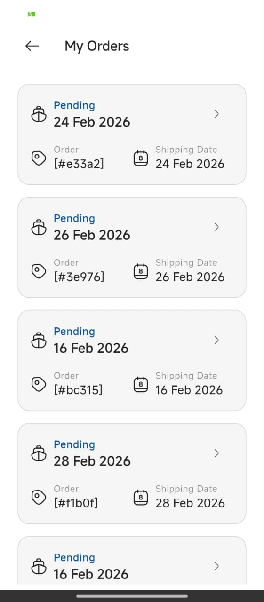 |

---

## Profile

| Profile                              | Edit Profile                             |
| ------------------------------------ | ---------------------------------------- |
| 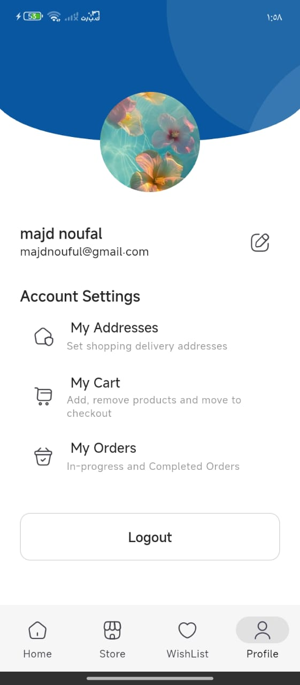 |  |

---

## Address Management

| Addresses                              | Delete Address                            |
| -------------------------------------- | ----------------------------------------- |
|  |  |

---

## Splash Screen

| Splash                              |
| ----------------------------------- |
|  |

---

# Project Structure

```
lib
 ┣ common
 ┣ data
 ┣ features
 ┣ utils
 ┗ main.dart
```

---

# Notes

This project is built as a **portfolio application** to demonstrate building scalable Flutter applications using modern tools and clean architecture practices.

Sensitive keys such as **Stripe API keys and Cloudinary secrets are removed from this repository** and should be added locally when running the project.

---

# Repository

https://github.com/majd604/ecommerce-app
